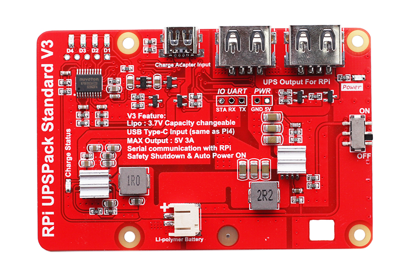
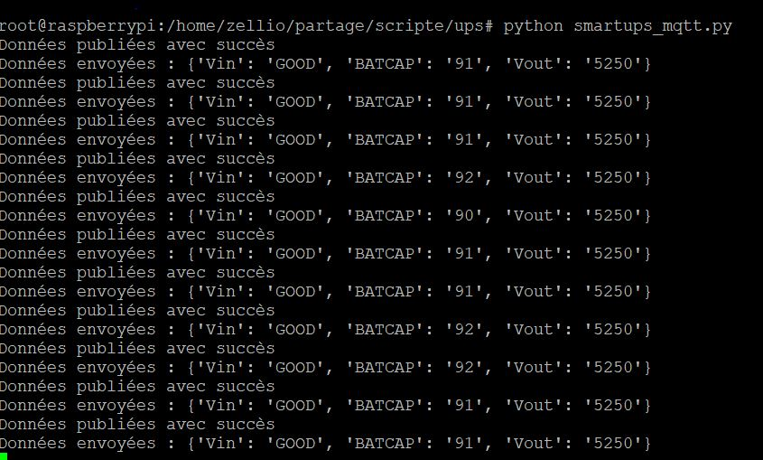
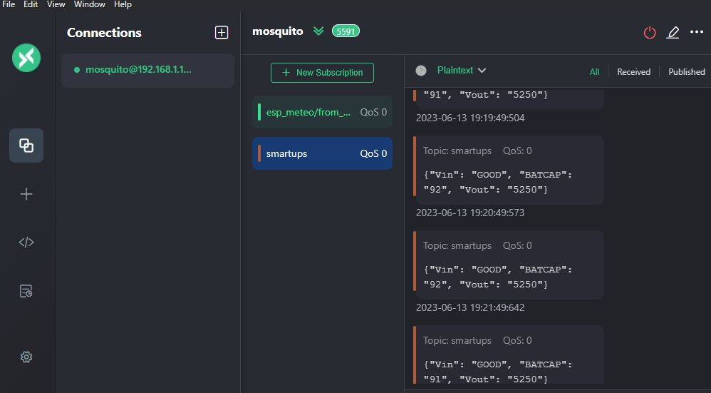

# Script Python pour l'envoi de données SmartUPS au broker MQTT

Ce script Python permet de lire les informations SmartUPS à partir d'un port série et de les envoyer périodiquement à un broker MQTT sous forme de messages JSON. Il est utile pour récupérer les informations sur l'alimentation, la capacité de la batterie et la tension de sortie d'un système SmartUPS et les intégrer à votre infrastructure MQTT existante.

le repository du  [UPSPACK_V3](https://github.com/rcdrones/UPSPACK_V3) développé par [rcdrones](https://github.com/rcdrones).



## Prérequis

Avant d'utiliser ce script, assurez-vous d'avoir les éléments suivants installés :

- Python 3.x
- Les bibliothèques Python : `serial`, `paho-mqtt`

## Configuration

1. Modifiez les paramètres du port série selon votre configuration :

   ```python
   port = '/dev/ttyS0'  # Port série à utiliser
   baudrate = 9600  # Débit en bauds

2. Modifiez les paramètres du broker MQTT selon votre configuration :

    ```python
    broker_address = 'localhost'  # Adresse IP ou nom d'hôte du broker MQTT
    port_mqtt = 8500  # Port du broker MQTT
    topic = 'smartups'  # Sujet MQTT pour l'envoi des données

    Utilisation

Assurez-vous d'avoir connecté le système SmartUPS au port série spécifié dans la configuration.

Exécutez le script Python en utilisant la commande suivante :


## Exécution du script :
    python smartups_mqtt.py

Le script lira les informations SmartUPS à partir du port série et les enverra périodiquement au broker MQTT sous forme de messages JSON.

## Câblage


## screenshot



Capture de [MQTTX](https://mqttx.app/)

